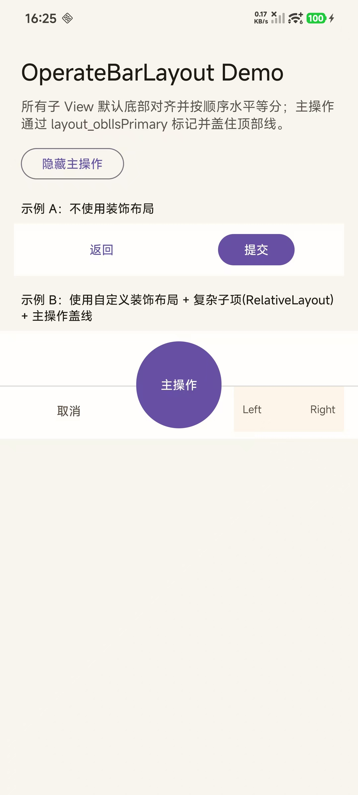

# OperateBarLayout

一个 Android 自定义 View 组件，用于在应用底部创建灵活的操作栏。

## 功能特性

- **均匀分布**：所有子 View 默认底部对齐并按顺序水平等分
- **主操作按钮**：支持通过 `layout_oblIsPrimary` 属性标记主操作按钮，主按钮会盖在装饰线之上
- **自定义装饰**：支持通过 `oblDividerLayout` 属性自定义装饰布局（如分割线），装饰 View 与操作项一样底部对齐



## 快速开始

### 添加依赖

```gradle
implementation 'io.github.xesam:operatebar:1.0.0'
```

### 基本使用

```xml
<io.github.xesam.android.operatebar.OperateBarLayout
    xmlns:app="http://schemas.android.com/apk/res-auto"
    android:layout_width="match_parent"
    android:layout_height="wrap_content"
    app:oblDividerLayout="@layout/my_decor">

    <Button
        android:layout_width="wrap_content"
        android:layout_height="48dp"
        android:text="返回" />

    <Button
        android:layout_width="wrap_content"
        android:layout_height="48dp"
        android:text="提交"
        app:layout_oblIsPrimary="true" />

</io.github.xesam.android.operatebar.OperateBarLayout>
```

## 属性说明

### OperateBarLayout 属性

| 属性 | 类型 | 说明 |
|------|------|------|
| `oblDividerLayout` | reference | 装饰布局的资源 ID，可以是任意 View 或 ViewGroup |

### 子 View 布局属性

| 属性 | 类型 | 说明 |
|------|------|------|
| `layout_oblIsPrimary` | boolean | 标记为主操作按钮，绘制时会盖在装饰线之上 |

### 装饰布局说明

装饰 View 与操作项一样默认底部对齐，通过 `android:layout_marginBottom` 控制与底部的距离：

```xml
<!-- res/layout/my_decor.xml -->
<View xmlns:android="http://schemas.android.com/apk/res/android"
    android:layout_width="match_parent"
    android:layout_height="1dp"
    android:layout_marginBottom="8dp"
    android:background="#26000000" />
```

## 工作原理

1. **测量阶段**：计算所有可见子视图的高度，确定布局的最终尺寸
2. **布局阶段**：将子视图均匀分布在水平方向，所有视图底部对齐
3. **绘制阶段**：按照 "普通子视图 -> 装饰视图 -> 主操作按钮" 的顺序绘制，确保主操作按钮在最上层

## 许可证

MIT License
