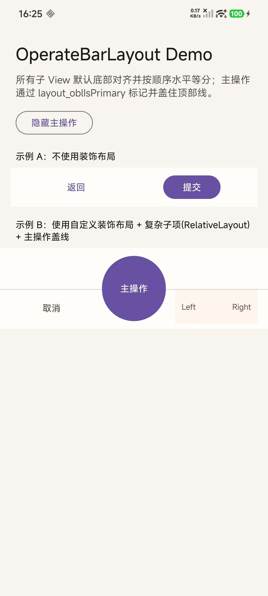

# OperateBarLayout

一个 Android 自定义 ViewGroup，专注于底部操作栏的三个核心场景：**子项等分 + 底部对齐 + 主操作压线**。



## 依赖

```gradle
implementation 'io.github.xesam:android-operatebar:0.0.2'
```

## 快速开始

```xml
<io.github.xesam.android.operatebar.OperateBarLayout
    xmlns:app="http://schemas.android.com/apk/res-auto"
    android:layout_width="match_parent"
    android:layout_height="wrap_content"
    app:oblDividerLayout="@layout/my_divider">

    <!-- 普通操作：等分剩余宽度 -->
    <Button
        android:layout_width="wrap_content"
        android:layout_height="48dp"
        android:text="取消" />

    <!-- 主操作：绘制在装饰线之上 -->
    <Button
        android:layout_width="wrap_content"
        android:layout_height="48dp"
        android:text="提交"
        app:layout_oblIsPrimary="true" />

</io.github.xesam.android.operatebar.OperateBarLayout>
```

## 属性

### OperateBarLayout

| 属性 | 类型 | 说明 |
|------|------|------|
| `app:oblDividerLayout` | reference | 装饰线布局资源，绘制在普通子项之上、主操作之下 |

### 子 View 布局属性

| 属性 | 类型 | 默认值 | 说明 |
|------|------|--------|------|
| `app:layout_oblIsPrimary` | boolean | false | 标记为主操作，绘制时压在装饰线上方 |

## 槽位分配规则

所有可见子 View 按添加顺序水平排列，宽度分配规则如下：

1. `isPrimary="true"` 且 `layout_width` 为**固定 dp 值**的子 View，先按指定宽度占位
2. 其余子 View（含 `isPrimary` 但 `layout_width` 为 `match_parent` / `wrap_content` 者）**等分剩余宽度**

```
示例：总宽 360dp，三个子 View
  取消（普通，wrap_content）
  主操作（isPrimary，layout_width="200dp"）  ← 固定槽
  更多（普通，wrap_content）

结果：取消 80dp | 主操作 200dp | 更多 80dp
```

`layout_width` 为 `match_parent` 或 `wrap_content` 时，该值只影响子 View 在槽内的渲染宽度，不影响槽位分配。

## 装饰线

装饰线通过 `oblDividerLayout` 属性引入，可以是任意布局，用 `layout_marginBottom` 控制纵向位置：

```xml
<!-- res/layout/my_divider.xml -->
<View xmlns:android="http://schemas.android.com/apk/res/android"
    android:layout_width="match_parent"
    android:layout_height="1dp"
    android:layout_marginBottom="52dp"
    android:background="#26000000" />
```

绘制顺序为：普通子 View → 装饰线 → 主操作（`isPrimary`），主操作在视觉上始终压住装饰线。

## 动态控制

装饰线 View 可通过 `getDecorView()` 在运行时控制可见性：

```java
View decorView = operateBarLayout.getDecorView();
if (decorView != null) {
    decorView.setVisibility(View.GONE);
}
```

## 许可证

MIT License
